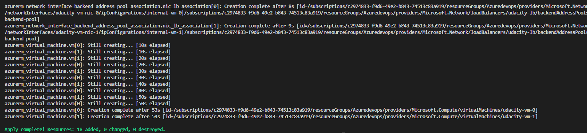
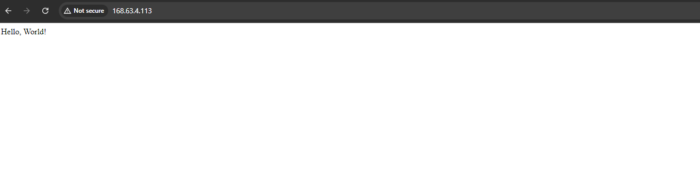

# Azure Infrastructure Operations Project: Deploying a scalable IaaS web server in Azure

### Introduction
For this project, you will write a Packer template and a Terraform template to deploy a customizable, scalable web server in Azure.

### Getting Started
1. Clone this repository

2. Create your infrastructure as code

3. Update this README to reflect how someone would use your code.

### Dependencies
1. Create an [Azure Account](https://portal.azure.com) 
2. Install the [Azure command line interface](https://docs.microsoft.com/en-us/cli/azure/install-azure-cli?view=azure-cli-latest)
3. Install [Packer](https://www.packer.io/downloads)
4. Install [Terraform](https://www.terraform.io/downloads.html)

### Instructions
#### 1. Build the Managed Image with Packer
1. Clone this repository:
```
git clone https://github.com/luongnguyentrong/azure-infra-iac
cd repo
```

2. Navigate to the packer/ directory:
```
cd packer
```

3. Run the Packer template to build the image:
```
packer init .
packer build server.pkr.hcl
```

#### 2. Deploy Infrastructure with Terraform
After building the custom image, we can use Terraform to deploy the infrastructure, including the VNet, NSG, VM, and Load Balancer.

1. Navigate back to the root directory:
```
cd ../terraform
```

2. Customize the [vars.tf](https://github.com/your/repo.git) (if needed):
    - **VM Count**: To change the number of the Virtual Machines, update the `vm_count` variable in `vars.tf`.
    ```
    variable "vm_count" {
    description = "Number of Virtual Machines to deploy"
    type        = number
    default     = 2
    }
    ```

    - **Location**: Change the Azure region by updating the `location` variable
    ```
    variable "location" {
    description = "The Azure region to deploy the resources in."
    type        = string
    default     = "West Europe"
    }
    ```

3. Apply the Terraform Templates: Once the `vars.tf` file is updated, run the following commands to provision the infrastructure:
```
terraform apply
```


### Output
1. After successfully running `terraform apply`, you should see an output like the image below: 


2. Once deployed, navigate to the load balancer's public IP in your browser. You should see the web server displaying the "Hello, World!" message:

